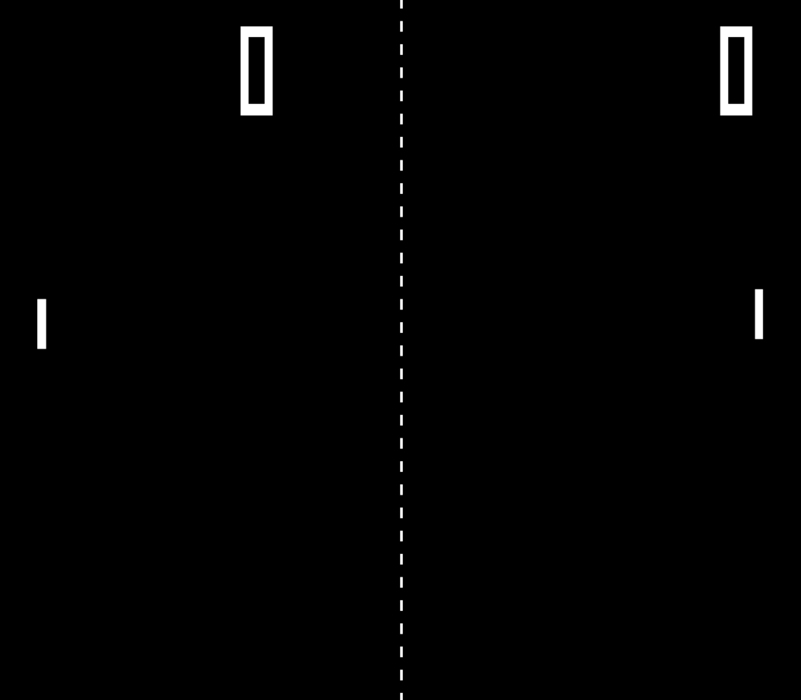

# Pong

## Description
A clone of the 1972 game for the Atari 2600: Pong. This was made in C++ using the SDL2 library.
The main purpose of this project is to learn the intricacies of simple game development.

## Gameplay
Both players are bound by the screen and can only move vertically.
The ball will bounce off the top and bottom edges of the screen and the players' paddles.
A point is scored anytime a ball touches the left and right edges of the screen for the opposite side it hit.
Player 1 is the left paddle and player 2 is the right paddle.
Player 1 is always controlled by a human but player 2 can toggle between simple AI (default) and human control.

**Controls:**
| Button | Action |
| ------ | ----- |
| Esc | Quit |
| R | Restart |
| A | Toggle player 2 AI |

**Player 1 Controls:**
| Button | Action |
| ------ | ----- |
| W | Move up |
| D | Move down |

**Player 2 Controls:**
| Button | Action |
| ------ | ----- |
| ↑ | Move up |
| ↓ | Move down |

## Usage
If you want to download and play on your own, there is currently only support for windows.
Ensure that MinGW is installed with C++ compilation then run `pong.bat` and launch `pong.exe`.